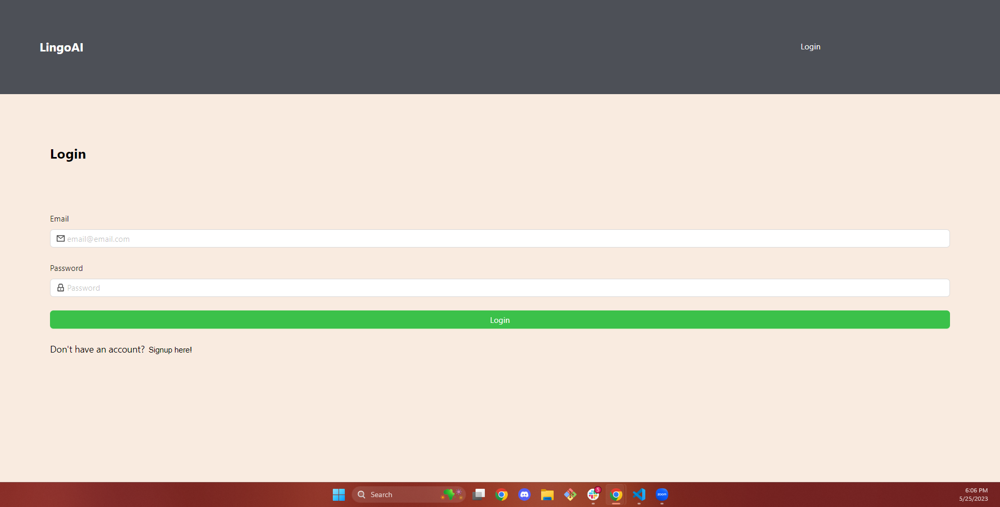
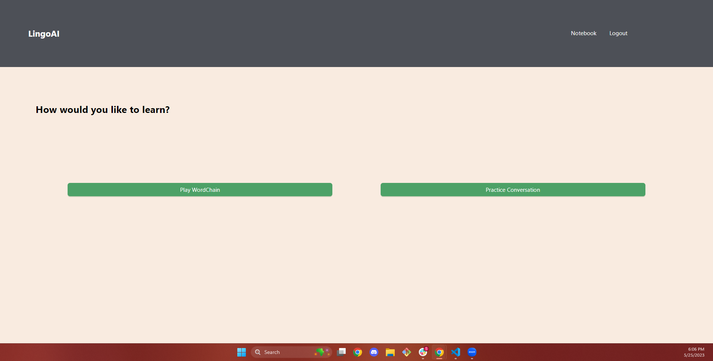
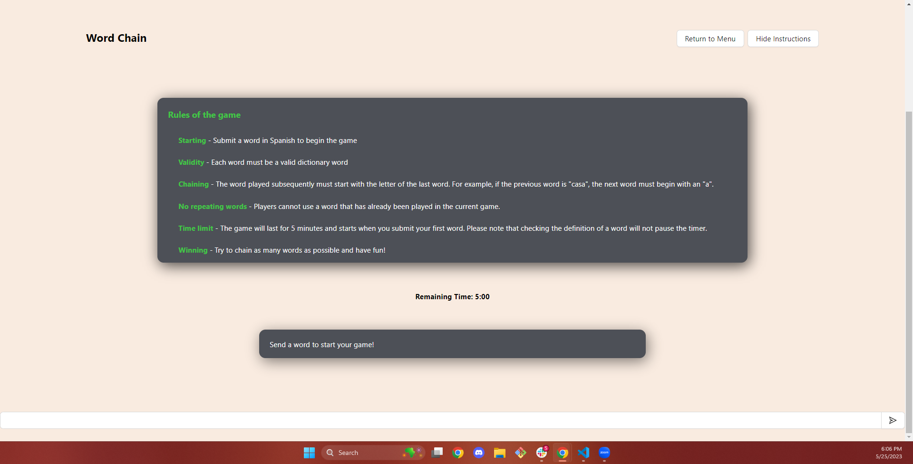
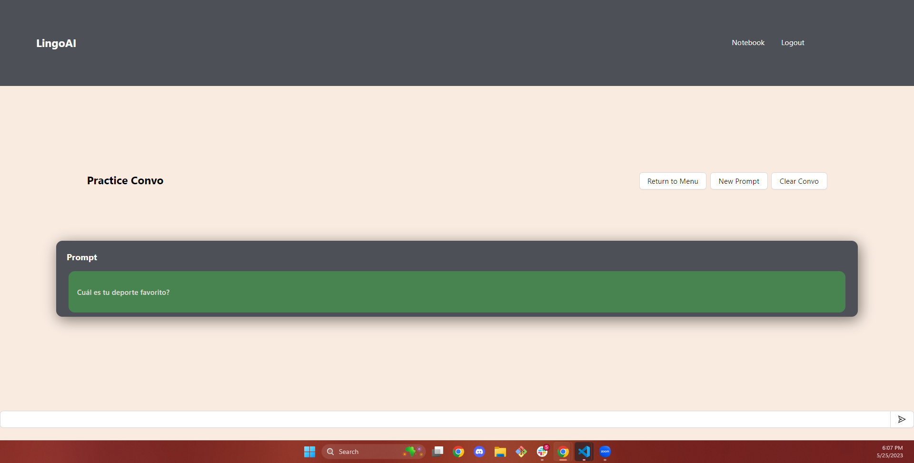

# LingoAI []

## Description
NOTICE - This is from a forked repository! The original repo is [here](https://github.com/AmirTahsini/project_atlas). Please note that the original application linked in that repo is now depreciated. 

LingoAI is a full-stack application that is aimed at non-native Spanish speakers, who have a minimum of beginner level of proficiency. Through creating an account or logging in, a user is able to either play a word chain game to test and expand their vocabulary against an AI or practice conversation with an AI. For caveats on the AI model in relation to language, please see the [Usage Section](#usage). In the game, a user is able to look at the translation of a word sent by the AI and save it to their notebook, where they can see all of their saved words with the option to delete, should they choose. LingoAI does not yet support studying words saved to the Notebook through LingoAI; users will have to self-study if they truly wish to expand their Spanish vocabulary.

LingoAI uses GraphQL and a NoSQL database. LingoAI also only supports Spanish at the moment, but the developers hope to expand to other languages in the future. 

Upon navigating to the [LingoAI application](https://lingoai.herokuapp.com/), users who are not logged in or do not have an account yet should be directed to the login/signup page: 

Upon signing up or logging in, a user is then directed to the home page, where they have the option to play the WordChain game or have a practice conversation:   

---
## Table of Contents

  - [Installation](#installation)
  - [Usage](#usage)
  - [License](#license) 
  - [Contributing](#contributing)
  - [Tests](#tests)
---

## Installation

A user does not need to install anything to access full functionality of LingoAI. Instead, a user should direct themselves to the deployed [link](https://lingoai.herokuapp.com/) and either login or sign up to start practicing. 

A developer should be sure to install all dependencies (command: `npm i`), and ensure that both the server and front-ended port is up and running (command: `npm run develop`). To properly run the application locally, developers should be sure to add and/or [create an OpenAI API key](https://platform.openai.com/account/api-keys) as well as an [NLP translate API key](https://rapidapi.com/gofitech/api/nlp-translation/) and add it to the .env file stored in the server directory.  Please look at the [dotenv documentation](https://www.npmjs.com/package/dotenv) regarding any questions on how this works.

This project also uses OpenAI for the chatbot model. Please consult the [OpenAI documentation](https://platform.openai.com/docs/introduction) regarding questions. 

## Usage

To make full use of LingoAI, one should remember their login credentials. Please click [here](https://lingoai.herokuapp.com/) to go to the LingoAI website. 

The developers also warn any users on the proper use of the AI Chatbot: we acknowledge that chatting with LingoAI will only simulate real conversation, and is not a substitute for chatting with real people. As language is a specifically human quality, we acknowledge that an AI, no matter how well it is trained (at least for the foreseeable future), will not be able to fully replicate the intracies and implicatures of human conversation. As a result, some responses will seem off to native speakers or semi-fluent speakers of Spanish. We also acknowledge that LingoAI will not help one to actually speak Spanish, but rather only improve their writing, reading, and writing skills. For users who wish to also improve their speaking abilities, we encourage users to speak with other Spanish-speakers. 

The developers also acknowledge that the [NLP Translation](https://rapidapi.com/gofitech/api/nlp-translation/) API is not a dictionary, but rather a translation application. As with other translation applications (ex. Google Translate, Papago, etc.), some translations will return incorrect or will not translate at all.

## License
  
  [License: MIT](https://opensource.org/licenses/MIT)
  
  Copyright 2023 Anna Langford, Dannon Rogers, Amir Tahsini
  
  Permission is hereby granted, free of charge, to any person obtaining a copy of this software and associated documentation files (the "Software"), to deal in the Software without restriction, including without limitation the rights to use, copy, modify, merge, publish, distribute, sublicense, and/or sell copies of the Software, and to permit persons to whom the Software is furnished to do so, subject to the following conditions:
  
  The above copyright notice and this permission notice shall be included in all copies or substantial portions of the Software.
  
  THE SOFTWARE IS PROVIDED "AS IS", WITHOUT WARRANTY OF ANY KIND, EXPRESS OR IMPLIED, INCLUDING BUT NOT LIMITED TO THE WARRANTIES OF MERCHANTABILITY, FITNESS FOR A PARTICULAR PURPOSE AND NONINFRINGEMENT. IN NO EVENT SHALL THE AUTHORS OR COPYRIGHT HOLDERS BE LIABLE FOR ANY CLAIM, DAMAGES OR OTHER LIABILITY, WHETHER IN AN ACTION OF CONTRACT, TORT OR OTHERWISE, ARISING FROM, OUT OF OR IN CONNECTION WITH THE SOFTWARE OR THE USE OR OTHER DEALINGS IN THE SOFTWARE.

  ## Contributing

  The three main developers are [Anna Langford](https://github.com/Anna-dxj), [Dannon Rogers](https://github.com/dannonrogers), and [Amir Tahsini](https://github.com/AmirTahsini)

  ChatGBT was consulted regarding some bugs in the code. 

  ## Tests

  This application has no tests. The developers encourage that if a future developer develops a test to add the instructions in this section of the README. 
